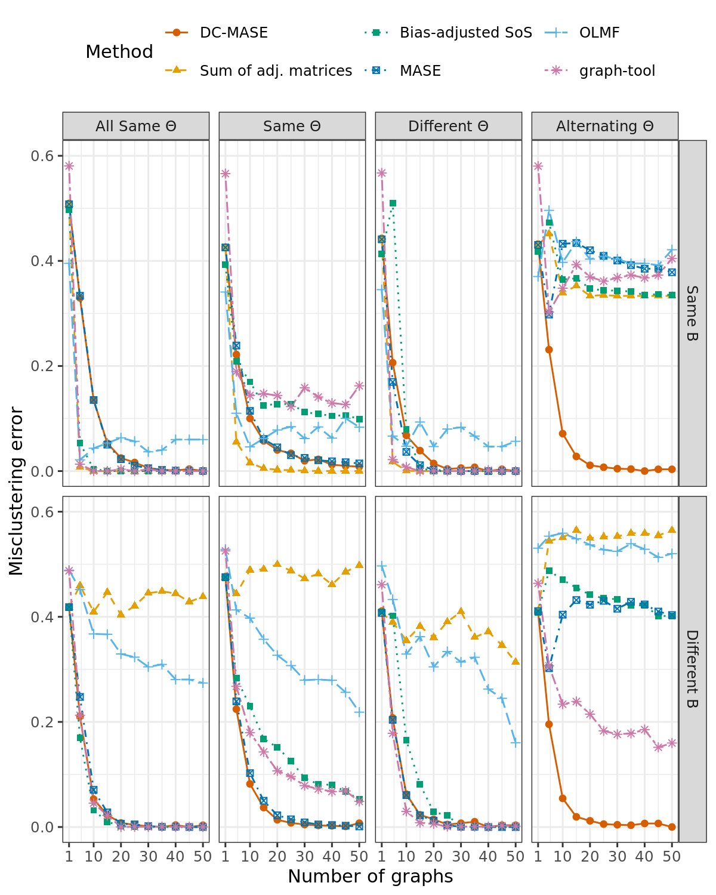
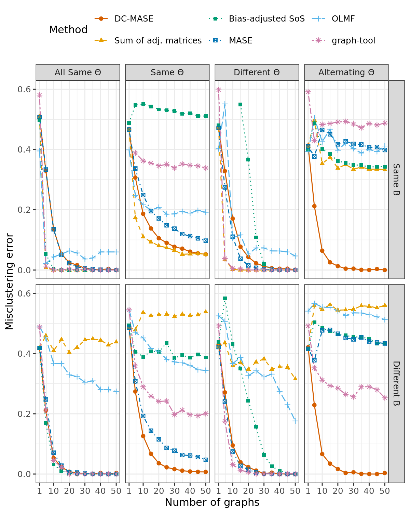
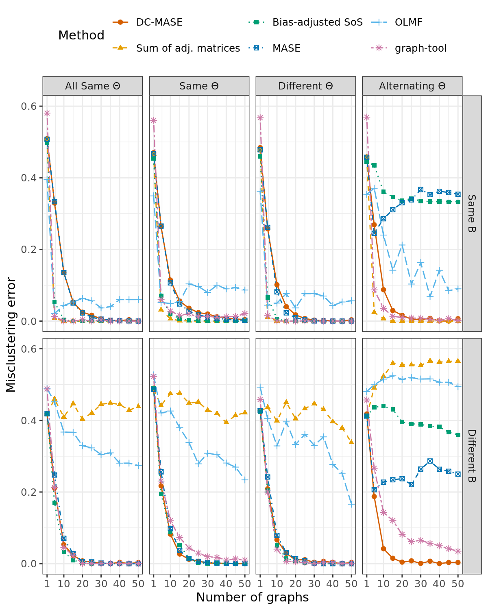
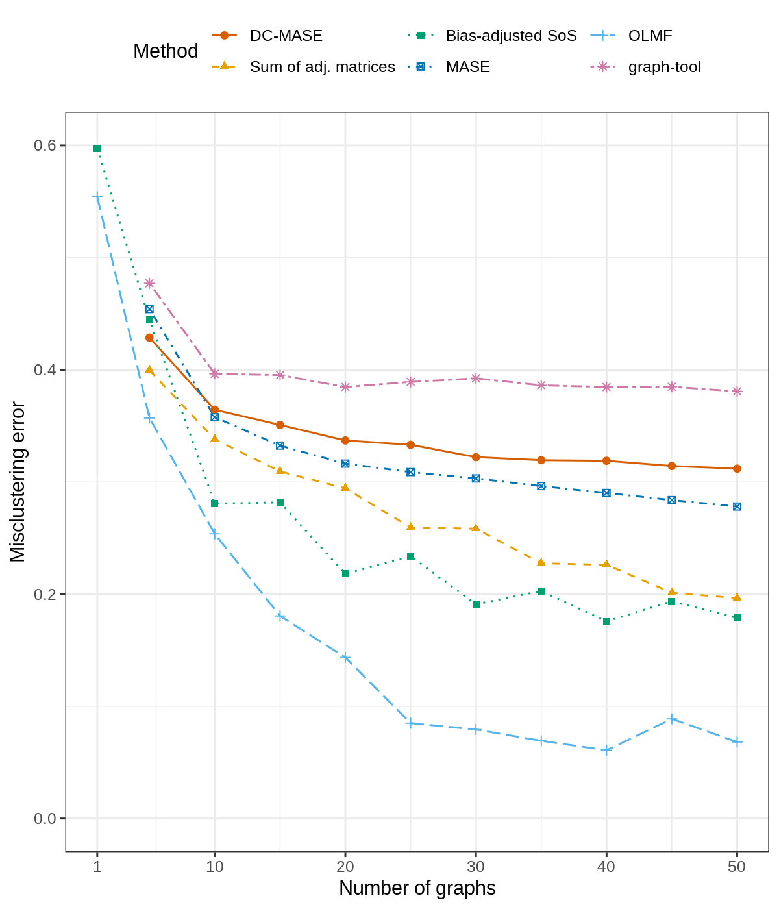
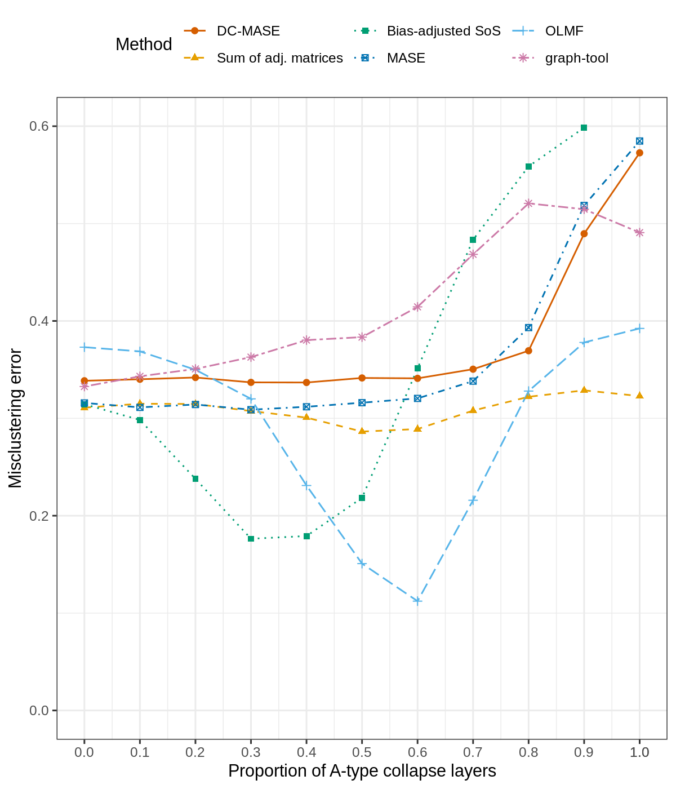

# Joint Spectral Clustering in Multilayer Networks — Extended Experiments

This repository is a course project for *Spectral Methods* (2025), forked from the [original implementation](https://github.com/jesusdaniel/dcmase) of the paper:

> Agterberg, J., Lubberts, Z., & Arroyo, J. (2025). Joint spectral clustering in multilayer degree-corrected stochastic blockmodels. *JASA*. [](https://arxiv.org/abs/2212.05053)

My contribution is the **extended simulation study** in [`Added-Simulations/`](./Added-Simulations/), which investigates two questions beyond the original paper:

1. **Setting B** — How robust is DC-MASE when the true data-generating model deviates from the standard DCSBM (nonlinear degree corrections)?
2. **Setting C** — What happens when the paper's key identifiability assumption (rank-$K$ signal per layer) is violated?

---

## Background

**Problem:** Given $L$ adjacency matrices (layers) over $n$ shared nodes, recover the community memberships $Z \in \{0,1\}^{n \times K}$.

**Standard model (Multilayer DCSBM):**
$$P^{(\ell)} = \Theta^{(\ell)} Z B^{(\ell)} Z^\top \Theta^{(\ell)}$$

where $\Theta^{(\ell)}$ is a diagonal matrix of per-node degree corrections that can vary across layers, $B^{(\ell)}$ is the layer-specific block connectivity, and $Z$ (community memberships) is shared.

**Method — DC-MASE:** Three steps:
1. **Scaled ASE** per layer: $X^{(\ell)} = U^{(\ell)}|\Lambda^{(\ell)}|^{1/2}$
2. **Row-normalize**: $Y^{(\ell)} = X^{(\ell)} / \|X^{(\ell)}\|_{\text{row}}$ — cancels $\Theta^{(\ell)}$, aligning embeddings across layers
3. **Joint SVD** of $[Y^{(1)} \mid \cdots \mid Y^{(L)}]$ → K-means clustering

Baselines compared: **MASE** (no degree correction), **Sum of Adj.**, **Bias-Adjusted SoS** (Lei & Lin 2023), **OLMF**.

---

## Extended Experiments

### Setting B — Nonlinear Degree Correction

The DCSBM assumes a **linear** relationship between degree corrections and the adjacency structure. I tested what happens when this is violated, by replacing $H = \Theta^{(\ell)} Z$ with a nonlinear transformation before constructing $P$:

- **B1 (Linear, baseline):** $P^{(\ell)} = H B^{(\ell)} H^\top$ with $H = \Theta^{(\ell)} Z$ — same as the standard DCSBM. Replicates the original paper's 6 scenarios, plus 2 new **"all-same $\Theta$"** baselines (scenarios 8/9, $\theta_{il} \equiv 1$) to check whether DC-MASE over-fits when there is no heterogeneity.

- **B2 (Quadratic perturbation):** $H_{nl} = H + \alpha H^2$ (elementwise), so $P^{(\ell)} = H_{nl} B^{(\ell)} H_{nl}^\top$. The model is now misspecified relative to DC-MASE's assumption.

- **B3 (Saturating nonlinearity):** $H_{nl} = H \mathbin{/} (1 + \beta H)$ (elementwise), a Michaelis–Menten-type saturation. Also misspecified.

Each B-variant is tested across the same **8 scenarios** (Same/Different $B$ × Same/Different/Alternating/All-same $\Theta$), with 100 replications.

**Results:**

| B1 (linear) | B2 (quadratic) | B3 (saturating) |
|:---:|:---:|:---:|
|  |  |  |

**Key findings:**
- DC-MASE is **not worse** than alternatives in any scenario across all three B-variants, and consistently improves as the number of layers increases.
- Under the **"all-same $\Theta$"** baseline (no degree heterogeneity at all), DC-MASE shows no advantage in few-layer regimes but does not hurt — it does not over-penalize for heterogeneity that isn't there.
- Under **nonlinear misspecification** (B2/B3), DC-MASE maintains its relative advantage in the alternating-$\Theta$ setting, suggesting the spherical normalization step is robust to moderate violations of the linear DCSBM assumption.

---

### Setting C — Identifiability Failure

The paper's Assumption 1 requires each layer to provide a **rank-$K$ signal** (i.e., $\text{rank}(B^{(\ell)}) = K$). I constructed two complementary rank-deficient B matrices:

- $B_A$: communities 1 & 2 merged (rank 2)
- $B_B$: communities 2 & 3 merged (rank 2)

All three communities are distinguishable across layers combined, but each individual layer only provides 2-dimensional signal out of the required $K=3$.

**C1 — L-sweep (x-axis: number of layers):** Layers alternate strictly between $B_A$ and $B_B$, with same $\Theta$ across layers. Tests whether more layers can compensate for the per-layer rank deficiency.

**C2 — delta-sweep (x-axis: proportion of $B_A$-type layers $\delta \in [0,1]$):** Fixes $L=20$ layers, randomizes the $B_A$/$B_B$ assignment at proportion $\delta$. At $\delta=0$ or $1$, all layers are of one type (completely non-identifiable); at $\delta=0.5$, both collapse patterns are equally represented. Tested under three theta structures:
- Same $\Theta$ across layers (`Simulations-C2.R`)
- Independently random $\Theta$ per layer
- Alternating $\Theta$ (`Simulations-C2-variants.R`)

**Results:**

| C1 (L-sweep) | C2 (delta-sweep, same $\Theta$) |
|:---:|:---:|
|  |  |

**Key finding:** DC-MASE struggles in both experiments. More layers (C1) do not rescue performance when every layer is rank-deficient, and even a balanced mix of $B_A$/$B_B$ layers (C2, $\delta=0.5$) does not help — finite-sample noise dominates the weak per-layer signal. This is a **failure case** showing Assumption 1 is practically necessary, not just a technical artifact.

---

## Repository Structure

```
├── R/                          # Core implementations
│   ├── dcmase.R               # DC-MASE algorithm
│   ├── comdet-dcmase.R        # Community detection wrapper
│   └── comdetmethods.R        # Baseline methods
├── Experiments/
│   └── run_all_methods.R      # All simulation functions (original + extended)
├── Added-Simulations/          # Extended experiments (my contribution)
│   ├── Simulations-B1.R       # Setting B1: linear DCSBM, 8 scenarios
│   ├── Simulations-B2.R       # Setting B2: quadratic nonlinearity
│   ├── Simulations-B3.R       # Setting B3: saturating nonlinearity
│   ├── Simulations-C1.R       # Setting C1: L-sweep, alternating rank-deficient B
│   ├── Simulations-C2.R       # Setting C2: delta-sweep, same Θ
│   ├── Simulations-C2-variants.R  # Setting C2: delta-sweep, random/alternating Θ
│   ├── Figures/               # Generated plots
│   └── Results-*.RData        # Cached results (100 reps each)
├── Data/
│   └── US_airport_data.RData  # 69 monthly US flight networks, 343 airports
└── Main - simulations.R        # Original paper simulation runner
```

---

## Requirements

R ≥ 4.2.1 with packages:

```r
install.packages(c("igraph", "mclust", "ScorePlus", "reshape2",
                   "ggplot2", "plyr", "ggthemes", "maps", "mapdata",
                   "rARPACK", "clue", "psych", "reticulate", "parallel"))
```
